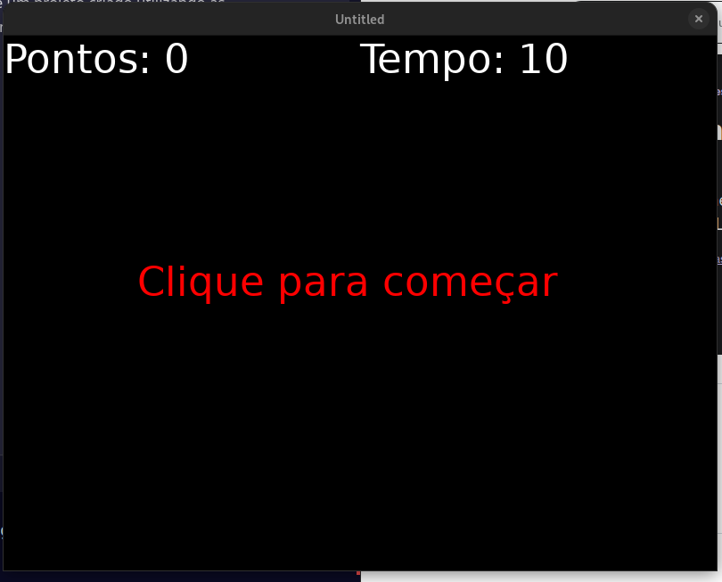
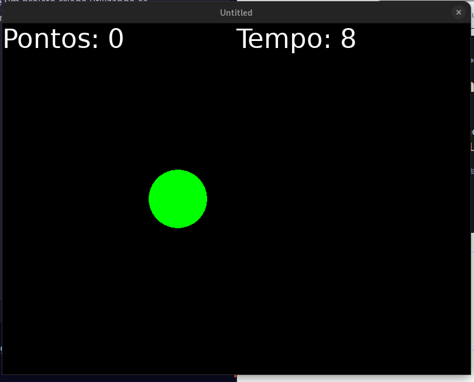

# Click Game

Este é um projeto criado utilizando as seguintes tecnologias:
* Linguagem: [Lua](https://www.lua.org/)
* Framework: [Love2D](https://love2d.org/)
* Editor: [Visual Studio Code](https://code.visualstudio.com/)

## Objetivo

O objetivo do jogo é clicar no maior número de bolinhas que aparecem na tela, antes do tempo acabar.

> Nota: Este jogo foi feito sob instrução do curso de [Love2d](https://www.udemy.com/course/lua-love/) da [Udemy](https://www.udemy.com/). Do Instrutor [Kyle Schaub ](http://kyleschaub.com/).